# Beyond The Security Team

_By Julien Vehent, Monday, September 30 2019._

_This is a keynote I gave to DevSecCon Seattle in September 2019._

* * *

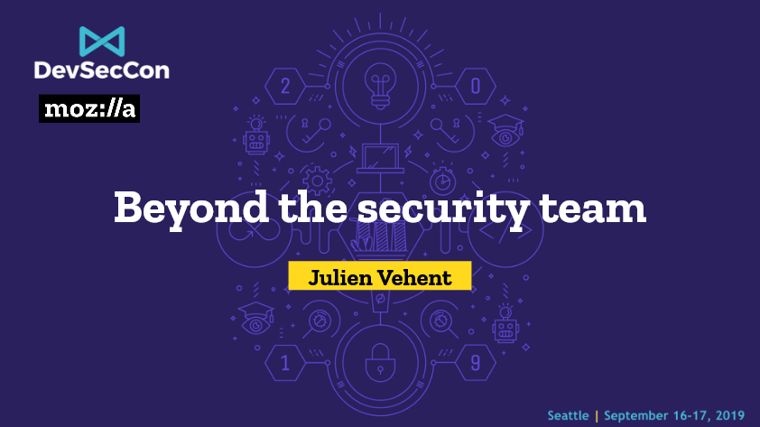

Good morning everyone, and thank you for joining us on this second day of DevSecCon. My name is Julien Vehent. I run the Firefox Operations Security team at Mozilla, where I lead a team that secures the backend services and infrastructure of Firefox. I’m also the author of Securing DevOps.

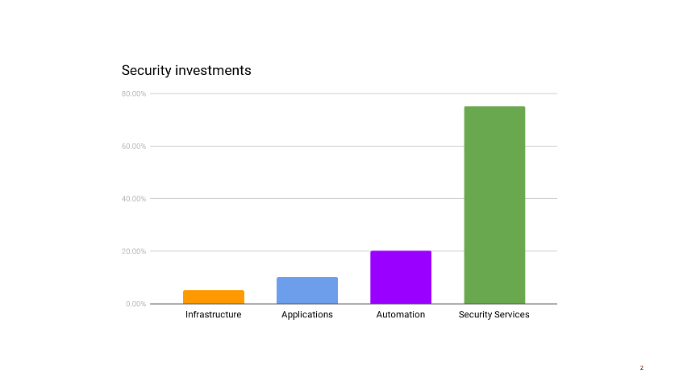

This story starts a few months ago, when I am sitting in our mid-year review with management. We’re reviewing past and future projects, looking at where the dozen or so people in my group spend their time, when my boss notes that my team is under invested in infrastructure security. It’s not a criticism. He just wonders if that’s ok. I have to take a moment to think through the state of our infrastructure. I mentally go through the projects the operations teams have going on, list the security audits and incidents of the past few months.

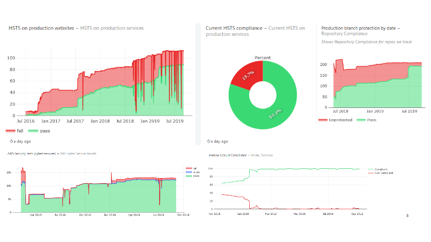

I pull up our security metrics and give the main dashboard a quick glance before answering that, yes, I think reducing our investment in infrastructure security makes sense right now. We can free up those resources to work on other areas that need help.

Infrastructure security is probably where security teams all over the industry spend the majority of their time. It’s certainly where, in the pre-cloud era, they use to spend most of their time.

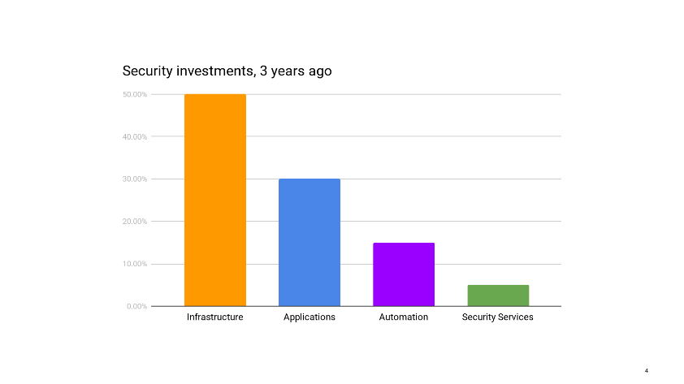

Up until recently, this was true for my group as well. But after years of working closely with ops on hardening our AWS accounts, improving logging, integrating security testing in deployments, secrets managements, instances updates, and so on, we have reached the point where things are pretty darn good. Instead of implementing new infrastructure security controls, we spend most of our time making sure the controls that exist don’t regress.

The infrastructure certainly does continue to evolve, but operations teams have matured to the point of becoming their own security teams. In most cases, they know best how to protect their environments. We continue to help, of course. We’re not far away. We talk daily. We have their back during security incidents and for the occasional security review. We also use our metrics to call out areas of improvements. But that’s not a massive amount of work compared to our investment from previous years.

I have advocated for some time now that operations teams make the best security teams, and every interaction that I have with the ops of the Firefox organization confirm that impression. They know security just as well as any security engineer would, and in most operational domains, they are the security experts. Effectively, security has gone beyond the security team.

So what I want to discuss here today is how we turned our organization’s culture from centralizing security to one where ownership is distributed, and each team owns security for their areas. I’d say it took us a little more than three years to get there, but let me start by going back a lot further than that.

## It didn’t use to be this way

I’m french. I grew up in cold and rainy Normandy. It’s not unlike Seattle in many ways. I studied in the Loire Valley and started my career in Paris, back in the mid-2000s. I started out by working in banks, as a security engineer in the web and minitel division of a french bank. If you don’t know what a minitel is, you’re seriously missing out. But that's a story for another time.

So I was working in suit and tie at a bank in Paris, and the stereotypes were true: we were taking long lunches, occasionally drinking wine and napping during soporific afternoon meetings. Eating lots of cheese and running out of things to do in our 8 or 9 weeks of vacations. Those were the days. And when it came to security, we were the supreme authority of the land. A group of select few that all engineers feared, our words could make projects live or die. 

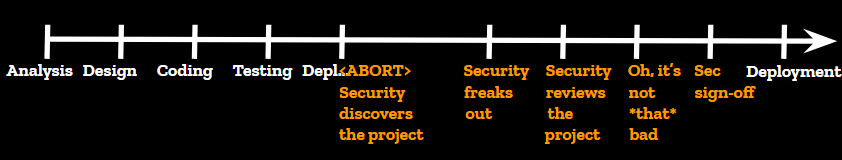

This is how a deployment worked back then. This was pre-devops when deployment could take three weeks and everyone was fine with it. An engineering group would kick off a projet, carefully plan it, come up with an elegant and performant design, spend weeks of engineering building the thing. And don’t get me wrong, the engineering teams were absolutely top-notch. Best of the best. 100% french quality that the rest of the world continues to envy us today. Then they would try to deploy their newborn and, “WAIT, what the hell is this?” asks the security team who just discovered the project.

This is where things usually went sideways for engineering. Security would freak out at the new project, complain that it wasn’t consulted, delay production deploys, use its massive influence to make last minute changes and integrate complex controls deep into the new solution. Eventually, it would realize this new system isn’t all that risky after all, it would write a security report about it, and engineering would be allowed to deploy it to production.

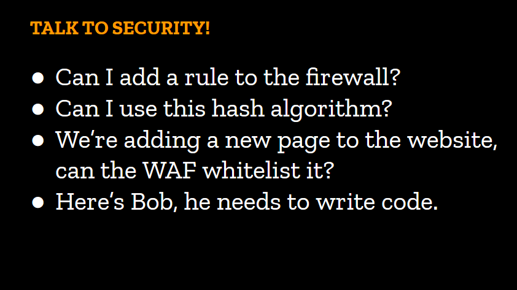

In those environments, trust wasn’t even an option. Security decisions were made by security engineers and that was that. Developers, operators and architects of all level were expected to field every security topic to the security team, from asking for permission to open a firewall rule, to picking a hash algorithm for their app. No one dared bypass us. We had so much authority we didn’t hesitate to go up against multi-million dollar projects. In a heavily regulated industry, no one wants a written record of the security team raising the alarm on their projects.

On the first day of the conference, we heard [Tanya](https://twitter.com/shehackspurple) talk about the need to shift left, and I think this little overly-dramatic story is a good example of why it’s so important that we do so. Shifting left means moving our security work closer to the design phases of engineering. It means being part of the early cycles of the SDLC. It means removing the security surprise from the equation. You’ve probably heard everyone mention something along those lines in recent years. I’m probably preaching to the choir here, but I thought it may be useful to remind those of us who haven’t lived through these broken security models why it’s so important we don’t go back to them.

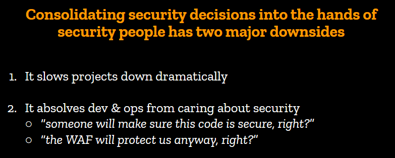

And consolidating security decisions into the hands of security people has two major downsides.

First, it slows projects down dramatically. We’ve talked about the 1 security engineer to 100 developer ratio yesterday. Routing all security topics through the security team creates a major bottleneck that delays work and generates frustrations. If you’ve worked in organizations that require security reviews before every push to production, you’ve experienced this frustration. Backlogs end up being unmanageable, and review quality drops significantly.

Secondly, non-security teams feel exempt from having to account for security and spend little time worrying about how vulnerable their code is to attacks, or how permeable their perimeter is. Why should they spend time on security, when the organization clearly signals that it isn’t their problem to worry about?

We knew back then this model wasn’t sustainable, but there was little incentive to change it. Security teams didn’t want to give up the power they had accumulated over the years. They wanted more power, because security was never good enough and our society as we knew it was going to end in an Armageddon of buffer overflows should the sysadmins disable SELinux in production to allow for rapid release cycles.

## Getting closer to devs & ops

Something that I should mention at this point is I’m an odd security engineer. What I love doing is actually building and shipping software, web applications and internet services in particular. I’ve been doing that for much longer than I’ve been doing security. At some point in my career, I was running a marketing website affiliated with “Who wants to be a millionaire”.

Yeah, that TV Game that airs every day at lunchtime around the country. They would air a question on the show that people had to answer on our website to win points they could use to buy stuff. I gotta say, this was a proud moment of my career. I felt a strong sense of making the world a better place then. It was powerful.

Anyways, this was a tiny operation, from a web perspective. When I joined, we had one java webapp directly connected to the internet, and one oracle database. I upgraded that to an haproxy load balancer, three app servers, and a beefier oracle database. It was all duct tape and cut corners, but it worked, and it made money. And it would crash every day. I remember watching the real-time metrics out of haproxy when they would air the question, and it would spike to 2000 requests per seconds until the site would fall down. Inevitably, every day, the site would break and there was nothing I could do about it. But business was happy because before we had crashed, we had made money.

The point I’m trying to make here is not that I’m a shitty sysadmin who use to run a site that broke every day. It’s that I understand things don’t need to be perfect to serve their purpose. Unless you work at a nuclear plant or a hospital, it’s often more important to serve the business than to have perfect security.

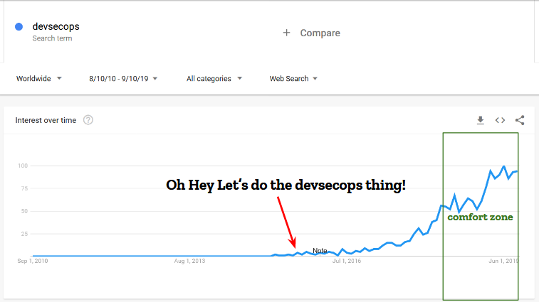

A little more than four years ago, I joined a small operations team focused on building cloud services for Firefox. They were adopting all the new stuff: immutable systems, fully automated deployments controlled by jenkins pipelines, autoscaling groups, load balancing based on application health, and so on. It was an exciting greenfield where none of my security training applied and everything had to be reevaluated from scratch. A challenge, if I ever had one. The chance to shape security in a completely different way.

So I joined the cloud operations team as a security engineer. The **only** security engineer. In the middle of a dozen of so hardened ops who were running stuff for millions of Firefox users. I live in Florida. We know that swimming in gator infested ponds is just stupid. The same way, security engineers generally avoid getting cornered by hordes of angry sysadmins. They are the enemy, you see. They are the ones who leave mission critical servers open to the internet. They are the ones who don’t change default passwords on network gears. They are the ones who ignore you when you ask for a system update seven times in a row. They are the enemy.

To be fair, they see us the same way. We’re Sauron, on top of our dark tower, overseeing everything. We corrupt the hearts and minds of their leaders. We add impossible requirements to time constrained projects. We generally make their lives impossible.

And here I was. A security guy. Joining an ops team.

By and large, they were nice folks, but it quickly became clear that any attempt at playing the arrogant french security guy who knows it all and dictates how things should be would be met with apathy. I had to win this team over. So I decided to pick a problem, solve it, make their life easier and win myself some goodwill.  
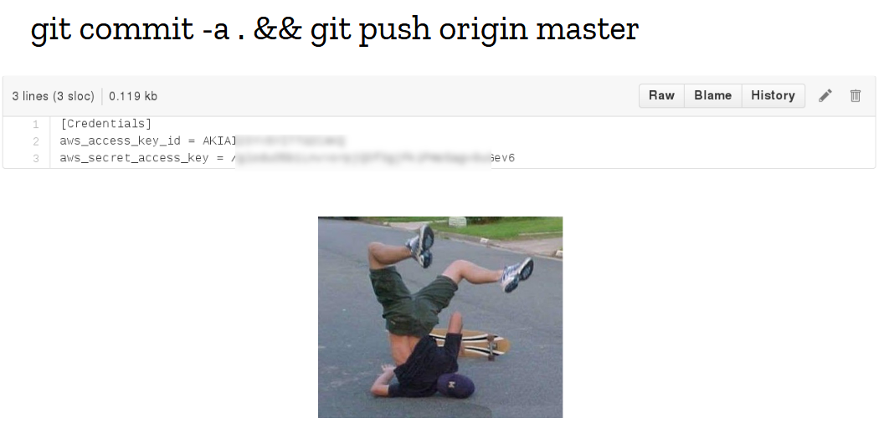

I didn’t have to search for long. Literally days before I joined the team, a mistake happened and the git repository containing all the secrets got merged into the configuration management repo. It was a beautiful fuck-up, executed with brio, with the full confidence of a battle-tested engineer who has ran these exact commands hundreds of times before. The culprit is a dear friend and colleague of mine who I like to use as an example of professionalism with the youngsters, and I strongly believe that what failed then was not the human layer, but completely inadequate tooling.

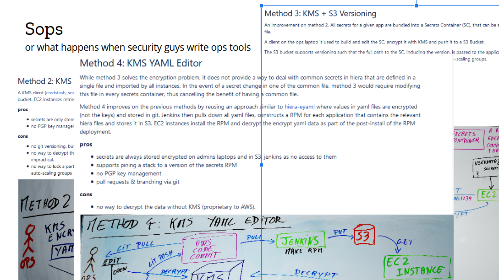

We took it as a wake up call that our process needed improvement. So as my first project, I decided to redesign secrets management. There was momentum. Existing tooling was inadequate. And it was a fun greenfield project. I started by collecting the requirements: applications needed to receive their secrets upon initialization, and in autoscaling groups that had to happen without a human taking action. This is a solved problem nowadays known as the bootstrapping of trust, where we use the identify given to an instance to grant permissions to resources, such as the ability to download a given file from S3 or the permission to decrypt with a KMS key. At the time, those concepts were still fairly new, and as I was working through the requirements, something interesting happened.

In a typical security project, I’d gather all the requirements, pick the best possible security architecture and implement it in the cleanest possible way. I’d then spend weeks or months selling my solutions internally, relentlessly trying to convert people to my cause, until everyone agreed or caved.

But in this project, I decided to talk to my customers first. I sat down with every ops who would use the thing and spent the first few weeks of the project studying the provisioning logic and the secrets management workflow. I also looked at the state of the art, and added some features I really wanted, like clean git history and backup keys.

By the time I had reached the fourth proposal, the ops team had significantly shaped the design to fit their needs. I didn’t need to sell them on the value, because by then, they had already decided they really needed, and wanted, the tool. Mind you, I hadn’t written a single line of code yet, and I wasn’t sure I could implement everything we had talked about. There was a chance I had oversold the capabilities of the tool, but that was a risk worth taking.

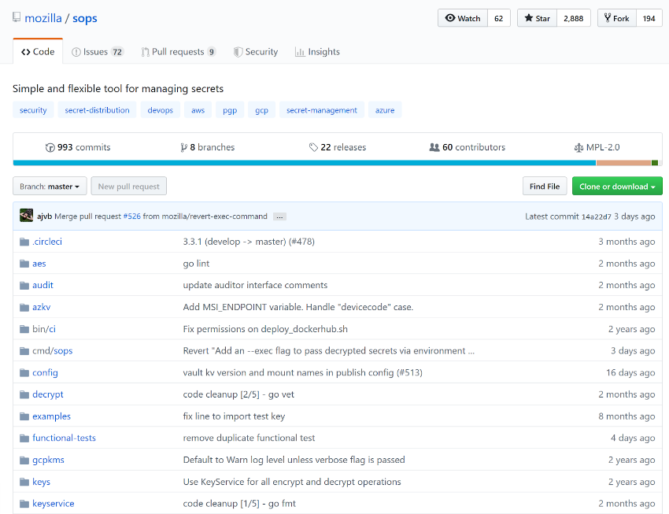

It took a couple of months to get it implemented. The first version was written in ugly Python, with little tests and poor cross-platform support. But it worked, and it continues to work (after a rewrite in Go). The result of this project is the open source secrets management tool called [Sops](https://github.com/mozilla/sops), which has been our internal standard for three and something years now. Since I started this talk, perhaps a dozen EC2 instances have autoscaled and called Sops to decrypt their secrets for provisioning.

## Don’t just build security tools.  
## Build operational tools that do things securely.

Today, Sops is popular DevOps tool inside and outside Mozilla, but more importantly, this project laid out the foundation of how security and operations would work together: strong collaboration on complex technical topics. We don’t just build security tools like we used to. We build operational tools that do things securely. This may seem like a distinction without a difference, but I found that it changes the way we think about our work from only being a security team, to being a security team that supports a business with specific operational needs. Effectively, it forces us to be embedded into operations.

I spent a couple years embedded in that operations team, working closely with devs & ops, sharing their successes and failures, and helping the team mature its security posture from the inside. I wrote [Securing DevOps](https://securing-devops.com) during those years, and I transferred a lot of what I learned from ops into the book.

I found it fascinating that, while I always had a strong opinion about security architecture and the technical direction we were taking, being down in the trenches dramatically changed my methods. I completely stopped trying to use my security title to block a project, or go against a decision. Instead, I would propose alternative solutions that were both viable and reasonable, and negotiate a middle ground with the parties involved. Now, to be fair, the team dynamic helped a lot, particularly having a manager who put security at equal footing with everything else. But being embedded with Ops, effectively being an ops, greatly contributed to this culture. You see, I wasn’t just any expert in the room, I was their expert in the room, and if something went sideways, I would take just as much blame as everyone else. ![Screenshot_2019-09-25_Beyond_the_Security_Team_-_DevSecCon_KeyNote_15_.png]img/Screenshot_2019-09-25_Beyond_the_Security_Team_-_DevSecCon_KeyNote_15_.png)  

There are two generally accepted models for building security teams. The centralized one, where all the security people report to a CISO who reports to the CEO, and the distributed one, where security engineers are distributed into engineering teams and a CISO sets the strategy from the top of the org. Both of these models have their pros and cons.

The centralized one generally has better security strategy, because security operates as a cohesive group reporting to one person. But its people are so far away from the engineering teams that actually do the work that it operates on incomplete data and a lot of assumptions.

The distributed model is pretty much the exact opposite. It has better information from being so close to where things happen, but its reporting chain is directly tied to the organization’s hierarchy, and the CISO may have a hard time implementing a cohesive security strategy org-wide.

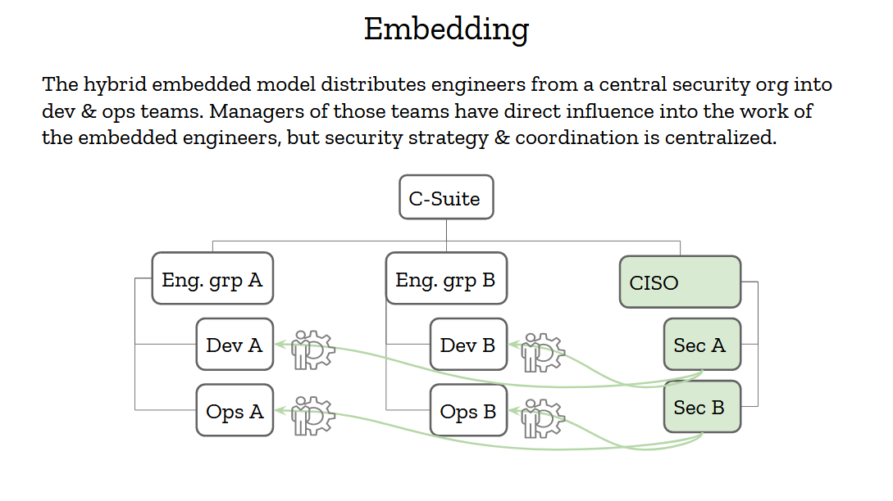

The embedding model is sort of a hybrid between these two that tries to get the best of both worlds. Having a strong security organization that reports to an influential CISO is good, and having access to real-world data is also critical to making the right decisions. Security engineers should then report to the CISO but be embedded into engineering teams.

Now, "embedded" here has a strong meaning. It doesn’t just mean that security people snoop into these teams chatrooms and weekly meetings. It means that the engineering managers of these teams have partial control of the security engineers. They can request their time and change their priorities as needed. If a project needs an urgent review, or an incident needs handling, or a tools needs to be written, the security engineers will step in and provide support. That’s how you show the organization that you’re really 100% in, and not just a compliance group on the outskirts of the org.

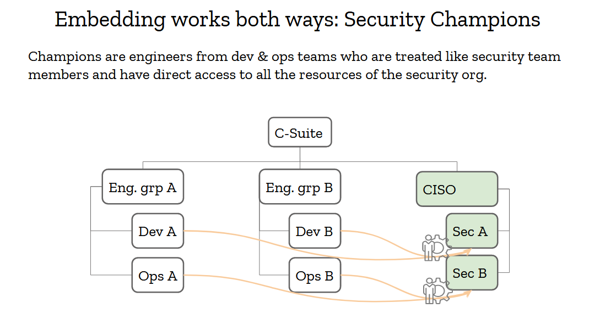

Reverse embedding is also very important, and we’ve had that model in the security industry for many years: it’s called security champions. Security champions are engineers from your organization who have a special interest in security. Oftentimes, they are more senior engineers who are in architect roles or deep experts who consider security to be a critical aspect of their work. They are the security team’s best friends. Its partners throughout the organization. They should be treated with respect and given as much support as possible, because they’ll move mountains for you.

Security champions should have full access to the security team. No closed doors meetings they are excluded from, no backchannel discussions they can’t participate in. If you can’t trust your champions, you can’t trust anyone in your org, and that’s a pretty broken situation.

Champions must also be involved with setting the security strategy. If you’re going to adopt a framework or a platform for its security properties, make sure to consult your champions. If they are on board, they’ll help sell that decision down the engineering chain.

## Avoid Making Assumptions

If you embed your security engineers into the dev and ops, and open the doors of your organization to security champions, you’ll allow information to flow freely and make better decision. This allow you to dramatically reduce the amount of assumptions you have to make every day, which directly correlates to stronger security.

<iframe allow="accelerometer; autoplay; encrypted-media; gyroscope; picture-in-picture" allowfullscreen="" src="https://www.youtube.com/embed/a9XwfzSr3mU" width="560" height="315" frameborder="0"></iframe>

The first project I worked on when I joined Mozilla was called [MIG](https://github.com/mozilla/mig/), for Mozilla InvestiGator (the logo was a gator, for investigator, get it?). The problem we were trying to solve was inspecting our live systems for indicators of compromise in real-time. Back in 2013, we already had too many servers to run investigations manually. The various method we had tried all had drawbacks. The most successful of them involved running parallel ssh from a bastion host that had ssh keys and firewall rules to connect everywhere. If that sounds terrifying to you, it’s because it was. So my job was to invent a system that could securely connect to all those systems to tell us if a file with a given checksum was present, which would indicate that a malware or backdoor existed on the host.

That project was cool as hell! How often do you get to spend 2 years implementing a completely novel agent-based system in a new language? I had a lot of fun working on MIG, and it saved our bacon a few times. But quickly what became evident was that we were running the same investigations over and over. We had some fancy modules that could look for byte strings in memory, or run complex analysis on files, but we never used them. Instead, we used MIG as an inventory tool to find out which version of a package was installed on a system, or which host could connect to the internet through an outbound gateway. MIG wasn’t so much of a security investigation platform as it was an inventory one, and it was addressing a critical need: the need for information.

Every security incident starts with an information gathering phase. You need to understand exactly how much is impacted, and what is the risk of propagation, before you can work on mitigation. The inventory problem continues to be a major concern in infosec. There are too many versions of too many applications running on too many systems for anyone to keep track of them effectively. Is this is even ignoring the problem Shadow IT poses to organizations that haven’t modernized fast enough. As security experts, we operate in the dark most of the time, so we make assumptions.

I’ve grown to learn that assumption are at the root of most vulnerabilities. The NYTimes wrote a [fantastic article](https://www.nytimes.com/2019/06/01/business/boeing-737-max-crash.html) to how Boeing built a defective 737 Max, and I’ll let you guess what’s at the core of it: assumptions. In their case, it’s – and I quote the New York Times article here - “After Boeing removed one of the sensors from an automated flight system on its 737 Max, the jet’s designers and regulators still proceeded as if there would be two“. The article is truly eye opening on how people making assumptions about various parts of the systems led to the plane being unreliable, to dramatic consequences.

I've made too many assumptions throughout my career, and too often did they prove to be entirely wrong. One of them even [broke Firefox](https://hacks.mozilla.org/2019/07/add-ons-outage-post-mortem-result/) for our entire user base. Nothing good comes from making assumptions.

## Assumptions lead to vulnerability

Assumptions leads to vulnerability. Let me say that one more time. Assumptions lead to vulnerability. As security experts, our job is to identify every assumption as a potential security issue. If you only get one thing out of this talk, please let it be this: every time someone uses the word “assume” in any context, reply we “let’s see how we can remove assumption”, or “do we have a test to confirm this?”

Nowadays, I assert the security maturity of an organization to how many assumptions its security team is making. It’s terrifying, really. But we have a cure, it’s Data. Having better inventories, something cloud infrastructure truly helps us with, is an important step toward fixing out of date systems. Clearing up assumptions on how systems interconnects reduces the attack surface. Etc, etc.

Data is a formidable silver bullet for a lot of things, and it must be at the core of any decent security strategy. The more data you have, the easier it it to take risk. Good security metrics updated daily is what helped me answer my boss’s question that we were okay reinvesting our resources in other areas. Those dashboards are also what upper management want to see. Not that they necessarily want to know the details of the dashboard, though sometimes they do, but they want to make sure you have that data, that you can answer questions about the organization’s security posture, and that you can make decisions based on accurate information.

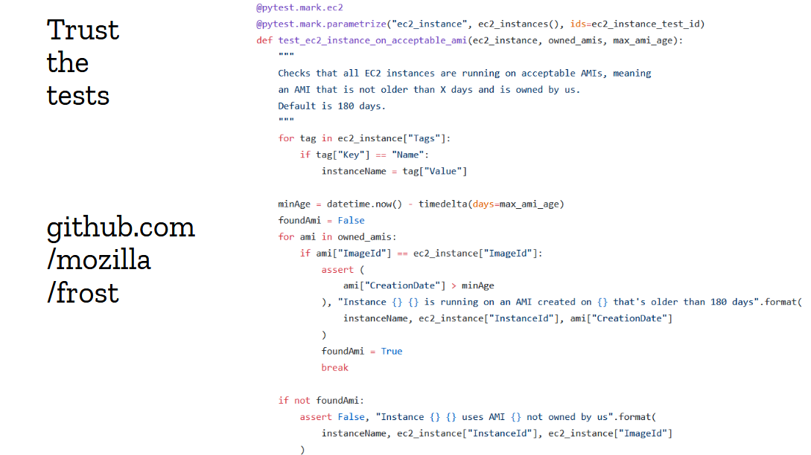

Data does not come out of thin air. To get good data, you need good tests, good monitoring and good telemetry. Security teams are generally pretty good at writing tests, but they don’t always write the right tests.

Above is an example of an AWS test from our internal framework called “frost”. It checks that EC2 instances are running on an acceptable AMI version. You can see that code for yourself, it’s open source at [github.com/mozilla/frost](https://github.com/mozilla/frost). What’s interesting about this test is that it took a few iterations to get it right. Our first attempt was just completely wrong and flagged pretty much every production instance as insecure, because we weren't aligned with the ops team, and had written the test without consulting them.

In this case, we flag an instance as insecure if it is running on an AMI that isn’t owned by us, and that is older than a configured max age. This is a good test, and we can give that data directly to the ops team for action. It’s really worthwhile spending extra time making sure your tests are trustworthy, because otherwise you’re sending compliance reports no one ever reads or take actions on, and you’re pissing people off.

## Setting the expectations

But data and tests only reflect how well you’re growing the security awareness in your organization. They don’t, in and of themselves, mature your organization. So while it is important to spend time improving your testing tools and metrics gathering frameworks, you should also spend time explaining to the organization what your ideal state is. You should set the expectations.

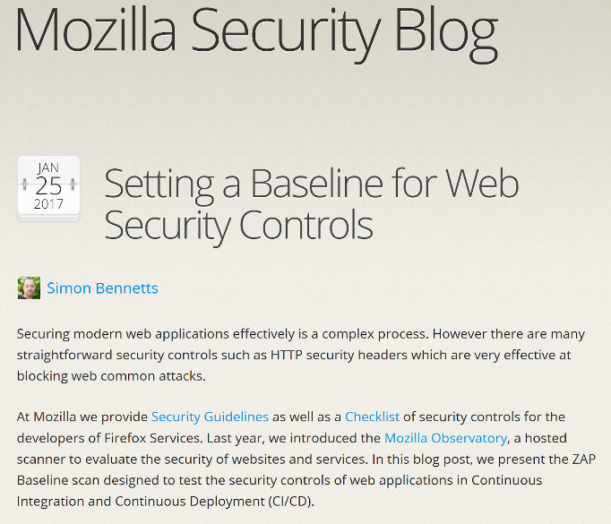

A few years ago, we were digging through our metrics to understand how we could get websites and APIs to a higher level of security. It was clear we weren’t being successful at deploying modern security techniques like Content Security Policy or HSTS. It seemed like every time we would perform a risk assessment, we would get a full buy-in from dev teams, and yet those controls would never make it to the production version. We had an implementation problem.

So we tried a few things, hoping that one of them would catch on.

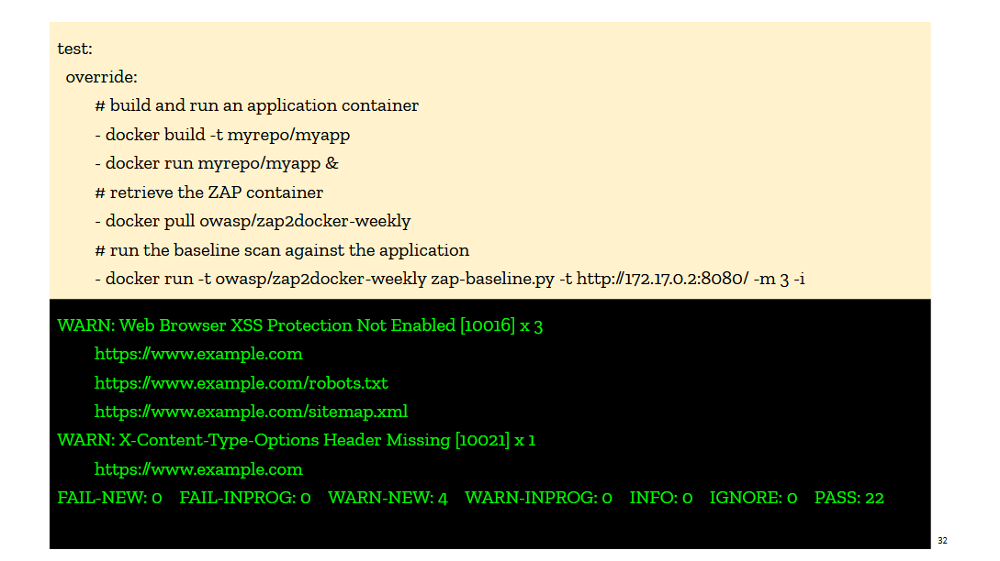

We first pushed on the idea that every deployment pipeline would invoke ZAP right after the pre-production site was deployed. I talked about this in the book under the idea of test-driven security, and I use examples of invoking a container running ZAP in CircleCI. The ZAP container would scan a pre-production version of the site and output a compliance report against a web security baseline. The report was explicit in calling out missing controls, so we thought it would be easy for devs to adopt it and fix their webapps. But it didn’t take off. We tried really hard to get it included in Jenkins deployment pipelines and web applications CI/CD, and yet the uptake was low, and fairly short lived. The integrations would get disabled as soon as it became annoying (too slow, blocking deploys, etc...). The tooling just wasn't there yet.

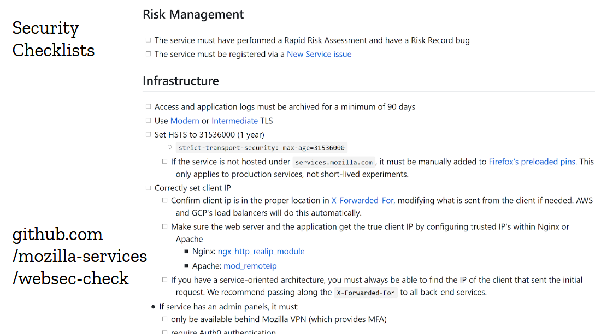

But the idea of the “baseline”, this minimal set of security controls we wanted every website and api to implement, was fairly successful. So [we turned it into a checklist](https://github.com/mozilla-services/websec-check) in markdown format that could easily be copied into github issues.

This one worked out beautifully. We would create the checklist in the target repository while running the risk assessment, and devs would go through it as part of their pre-launch check. Over time, we added dozens of items to the checklist, from new controls like checking for out-of-date dependencies, to traps we wanted devs to avoid like refusing to proxy requests to aws instances metadata. The checklist got big, and many items don’t apply to most projects, but we just cross them off and let the devs focus on the stuff that matters. They seem to like it.

And something else interesting happened: project managers started tracking completion of the checklist as part of their own pre-launch checklist. We would see security checklist completeness being mentioned as part of a readiness meeting with directors. It got taken seriously, and as a result every single website we launched over the last couple years implements content security policy, HSTS, same site cookies and so on.

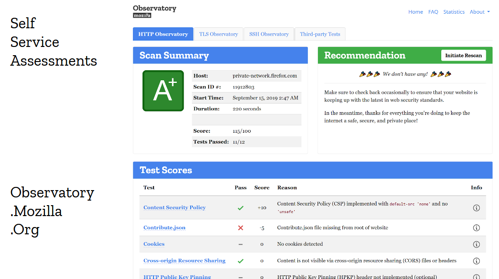

The checklist isn’t the only thing that helped improve adoption. Giving developers self-service security tools is also very important. And the approach of giving letter-grades has an interesting psychological effects on engineering teams, because no one wants to ship a production site that gets an F or even a C on the publicly accessible security assessment tool. Everyone wants an A+. And guess what? Following the checklist does give you an A+. That makes the story pretty straightforward: follow the checklist, and you’ll get your nice A+ on the [Observatory](https://observatory.mozilla.org/).

## Clear Expectations  
## ↓  
## Checklist  
## ↓  
## Self Assessment  
## ↓  
## Profit

This particular model may not work exactly for your organization. The power dynamics and internal politics may be different. But the general rule still applies: if you want security to be adopted in products that ship, set the expectations early and clearly. Don’t give them vague rules like “only use encryption algorithms that provide more than 128 bits of security”. No one knows what that means. Instead, give them information they can directly translate into code, like a content security policy they can copy and paste then tweak, or a logging library they can import in their apps that spits out the right format from the get go. Set the expectations, and make them easy to follow. Devs and ops are too busy to jump through hoops.

Once you’ve set the expectations, give them checklists and the tools to self-assess. Don’t make your people have to ask you every time they need a check of their webapp, it bothers them as much as it bothers you. Instead, give them security tools that are fully self-service. Give them a chance to be their own security team, and to make you obsolete. Clear expectations and self-service security tools is how you build up adoption.

## Not having to say “no”

There is another anti-pattern of security team I’d like to address: it’s the stereotypical “no” team. The team that operates in organizations where engineers keep bringing up projects they feel they have to shut down because of how risky they are. Those security people are usually not a happy bunch. You rarely see them smile. They complain a lot. They look way older than they really are. Maybe they took up drinking.

See, I’m a happy person. I enjoy my work, and I enjoy the people I work with, and I don’t want to end up like that. So I set a personal goal to pretty much never having to say no. 

I have a little one at home. She’s a little over a year old and just started walking. She’s having a blast really, and it’s a sight to see her run around the house, a huge smile on her face, using her newly acquired skills. For her mother and I, it’s just plain terrifying. Every step she takes is a potential disaster. Every furniture in the house that isn’t covered in foam and soft blanket is a threat. Every pot, jar, broom, cat or dog is a weapon she could get her hands on at any moment. The threat modeling of a parent is simple: “EVERYTHING IS DANGEROUS, DO NOT LET THIS CHILD OUT OF SIGHT, NO YOU CAN’T CLIMB THE STAIRS ON YOUR OWN, DON’T LICK THAT KNIFE!”. ![Screenshot_2019-09-25_Beyond_the_Security_Team_-_DevSecCon_KeyNote_25_.png]img/Screenshot_2019-09-25_Beyond_the_Security_Team_-_DevSecCon_KeyNote_25_.png)

The safe approach here should be simple: cover the little devil in bubble wrap, and don’t let her leave the safe space of her playpen. There, problem solved. Now if she could just stop growing...

And by the way, you CAN buy bubble wrap baby suits. It’s a thing. For those of you with kids, you may want to look into it. 

There is a famous quote from one of my personal hero: Rear Admiral Grace Hopper. She invented compilers, back when computers were barely a thing. She used to hand out nanoseconds to military officers to explain how long messages took to travel over the wire. A nanosecond here is a small piece of wire about 30cm long (that’s almost a foot, for all you americans out there) that represent the maximum distance that light or electricity can travel in a billionth of a second. When an admiral would ask her why it takes so damn long to send a message via a satellite, she’d point out that between here and the satellite there’s a large number of nanoseconds.

Anyway, Admiral Hopper once said “ships are safe in harbor, but that’s not what ships are for”. If you only remember two things from this talk, add that one to the list.  
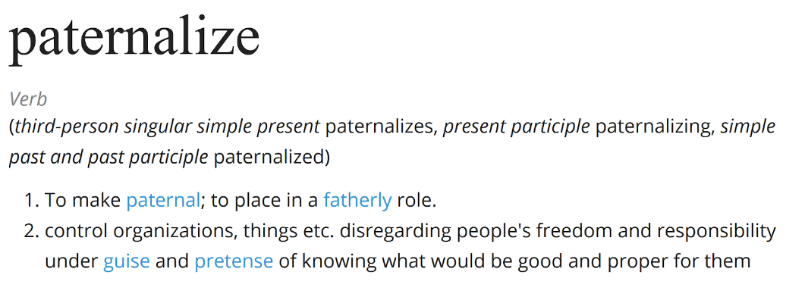  

As a dad, it is literally my job to paternalize my kid. A lot of security teams feel the same way about their daily job. Let me argue here, that this is completely the wrong approach. It’s not your job to paternalize your organization. The people you work with are adults capable of making rational decisions, and when they decide to ignore a risk, they are also making a rational decision. You may disagree with it, and that’s fine, but you shouldn’t presume that you know better than everyone else involved.

What our job as security professionals really is, is to help the organization make informed decision. We need to surface the risks, explain the threats, perhaps reshape the design of a project to better address some concerns. And when everything is said and done, the organization can decide for itself how much risk it is willing to accept.

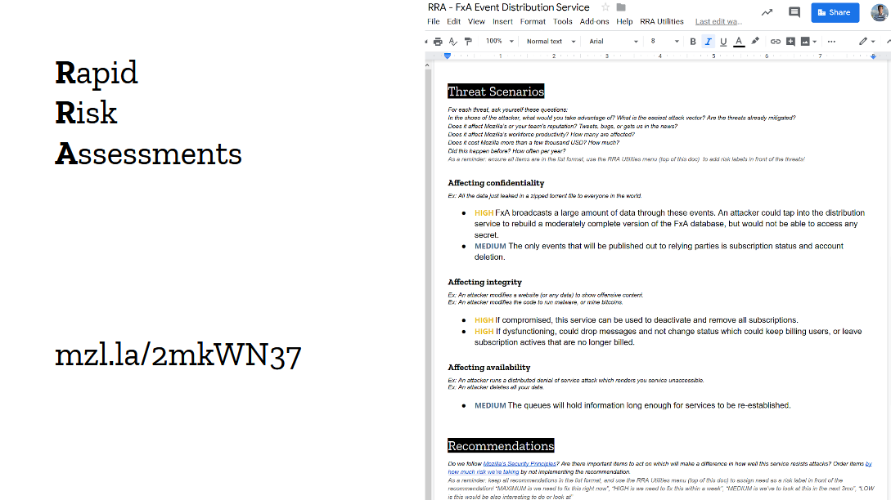

At Mozilla, Instead of saying no, we run [risk assessments and threat models](https://infosec.mozilla.org/guidelines/risk/rapid_risk_assessment.html) together as a team, then we make sure everyone agrees on the assessment, and if they think it’s an appropriate amount of risk to take. The security team may have concerns over a specific feature, only to realize during the assessments those concerns aren’t really that high. Or perhaps they are and the engineering team didn’t realize that until now, and is perfectly willing to modify or remove that feature entirely. And sometimes the project simply is risky by nature, but it’s only being rolled out to a small number of users while being tested out.

The point of risks assessments and threat modeling isn’t only to identify the risks. It’s to help the organization make informed decisions about those risks. A security team that simply says “no” doesn’t solve anyone’s problems, instead, build yourself an assessment framework that can evaluate new projects and features, and can get people to take calculated risks based on the environment the business operates in.

We call this framework [the “Rapid Risk Assessment”, or RRA](https://infosec.mozilla.org/guidelines/risk/rapid_risk_assessment.html). [Guillaume Destuynder](https://www.linkedin.com/in/guillaumedestuynder) and I introduced this framework at Mozilla back in 2013, and over the last 6 years we have ran hundreds, if not thousands, of RRAs with everyone in the organization. I still haven’t heard anyone find the exercise a waste of time. RRAs are a bit different from the standard risk assessments. They are short, 30 minutes to one hour, and focused on small components. It’s more of a security and threat discussion than a typical matrix-based risk framework, and I think this is why people actually enjoy them. One particular team even told me once they were looking forward to running the RRA on their new project. How cool is that?

Having a risk assessment framework is nice, but you can also get started without one. In the panel yesterday, [Zane Lackey](https://twitter.com/zanelackey) told the story of introducing risk assessments at Etsy by joining engineering meetings and simply asking "How would you attack this app?" to the devs. This works, I've asked similar questions many times. Guillaume's favorite is "what would happen should the database leak on Twitter?". Devs & Ops are much better at threat modeling than they often realize, and you can see the wheels spinning in their brains when you ask this type of question. Try it out, it's actually fun!

## Being Strategic

By this point in the talk, I hope that I’ve convinced you security is owned well beyond the security team, and you might be tempted to think that, perhaps we could get rid of all those pesky security people altogether. I’ll be honest, that’s the end game for me. The digital world will adopt perfect security. People will carefully consider their actions and take the right amount of risk when appropriate. They will communicate effectively and remove all assumptions in their work. They will treat each other with respect during security incidents and collaborate effectively toward a resolution. And I’ll be serving fresh Mojitos at a Tiki bar over there by the beach.

Not a good deal for security conferences really. Sorry Snyk, this may have been a [bad investment](https://snyk.io/blog/snyk-has-acquired-devseccon/). But I have a feeling they’ll be doing fine for a while. Until those blessed days come, we’ve got work to do.

A mature security team may not need to hold the hands of its organization anymore, but it still has one job: it must be strategic. It must foresee threats long before they impact the organization, and it must plan defenses long before the organization has to adopt them. It’s easy for security teams to get caught into the tactical day to day, go from review to incident to review to incident, but doing so does not effectively improve anything. The real gratification, the one that no one else gets to see but your own team, is seeing every other organization but your own battle a vulnerability you’re not exposed to because of strategic choices you’ve made long ago.

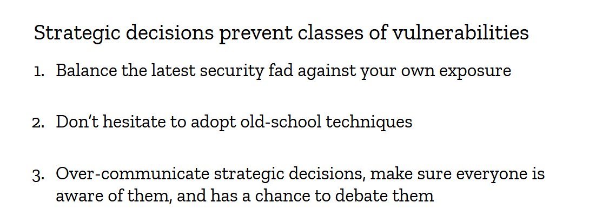

Let me give you an example: I’m a strong supported of putting our [admin panels behind VPN](/blog/index.php?post/2019/01/17/Maybe-don-t-throw-away-your-VPN-just-yet). Yes, VPNs. Remember them? Those old dusty tunnels that we use to love in the 2000s until zero trust became all the rage and every vendor on the planet wanted you to replace everything with their version of it. Well, guess what, we do zero trust, but we also put our most sensitive admin panels behind VPN. The reason for it is simply defense in depth. We know authentication layers fail regularly, we have tons of data to prove it, and we don’t trust them as the only layer of defense.

Do developers and operators complain about it? Yes, absolutely, almost all the time. But they also understand our perspective, and trust us to make the right call. It all ties together: you can’t make strategic decisions for your organizations if your own people don’t trust you.

So what else should you be strategic about? It really depends on where you’re operating. Are you global or local? What population do you serve? Can your services be abused for malicious purpose?

For example, imagine you’re running a web business selling birthday cards. You could decide to automatically close every account that’s created or accessed from specific parts of the world. It would be a drastic stance to take, but perhaps the loss of business is cheaper than the security cost. It’s a strategic decision to make, and it’s the role of a mature security team to help its leadership make it by informing on the risks.

I personally like the idea that each component of your environment should be allow to blow up without impacting the rest of the infrastructure. I don’t like over-centralization. This model is nice when you work with teams that have varying degrees of maturity, because you can let them do their things without worrying about dragging everyone down to the lowest common denominator. In practice, it means we don’t put everything in the same AWS accounts, we don’t use single sign on for certain things that we consider too sensitive, and so on. The point is to make strategic decisions that make sense for your organization.

Whatever decision you make, spend time documenting it, and don’t forget to have your champions review them and influence them. Build the security strategy together, so there is no confusion that this is a group effort the entire organization has bought into. It will make implementing it a whole lot easier.

So in closing, I’d like to leave you with this: a security team must help the organization make strategic security decisions. To do so, it must be trusted. To be trusted, its need to have data, avoid making assumptions, set clear expectations and to avoid saying no. And above all, it must be embedded across the organizations.

## To go beyond the security team
## Get the security team closer to your organization

Thank you.

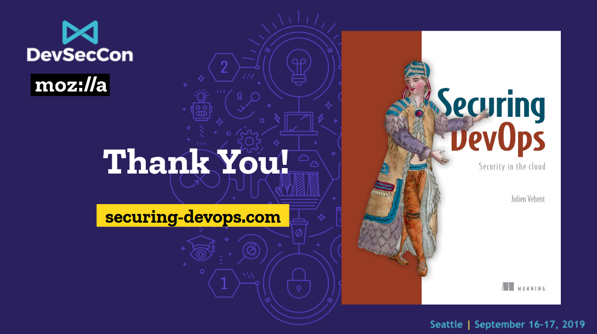

